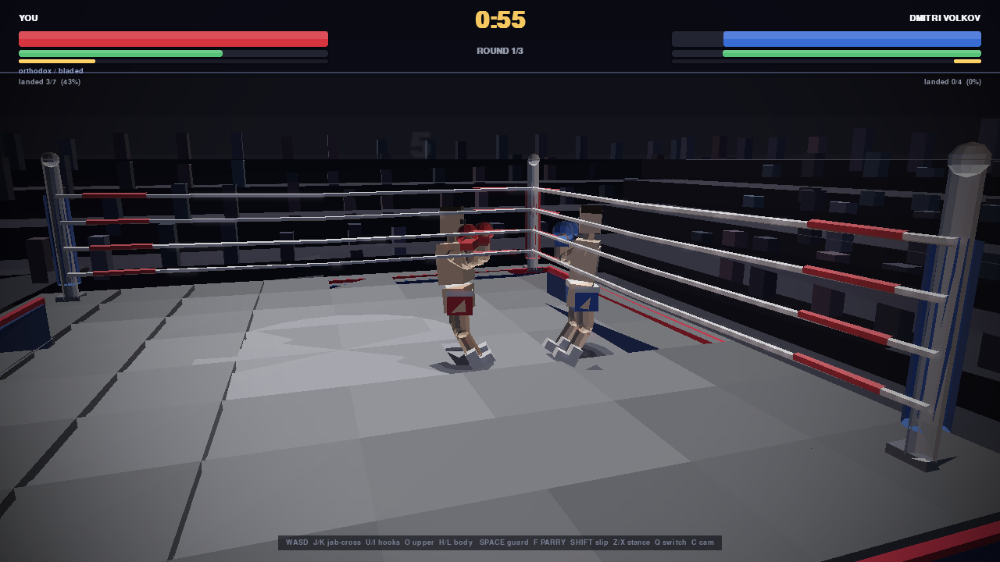

# Boxing PY Sim

A 3D boxing simulator built **out of pygame** — no OpenGL, no game engine, no
binary assets. The 3D is a software rasteriser written from scratch with numpy,
so it runs anywhere pygame runs.



## Run it

```bash
python3 play.py
```

That is the whole setup. On first run it builds a private environment in
`.venv/` and installs pygame + numpy (~30 seconds, once), then starts the game.
Every later run starts immediately. Any arguments are passed straight through:

```bash
python3 play.py --difficulty Champion --rounds 12
python3 play.py --quality low --no-crowd     # slower machines
python3 play.py --help
```

<details>
<summary>Prefer to manage dependencies yourself?</summary>

`pip install -r requirements.txt` is refused by most current systems
(Debian/Ubuntu/Fedora and Homebrew python are "externally managed", PEP 668),
which is exactly why `play.py` exists. To do it by hand:

```bash
python3 -m venv .venv
.venv/bin/pip install pygame numpy
.venv/bin/python main.py
```
</details>

---

## Controls

| Key | Action |
| --- | --- |
| `W` `A` `S` `D` | Move / circle |
| `J` | Jab | 
| `K` | Cross |
| `U` / `I` | Lead hook / rear hook |
| `O` | Uppercut |
| `H` / `L` | Body jab / body hook |
| `SPACE` | Block (hold high guard) |
| `F` | **Parry** — tap-timed deflect, punishes the attacker |
| `SHIFT` | Slip / duck under a head shot |
| `Z` / `X` | Square up / blade the stance |
| `Q` | Switch orthodox ↔ southpaw |
| `A`+`D` mash | Beat the count when you're dropped |
| `C` | Cycle camera (broadcast / close / corner / cinematic / overhead) |
| `V` | Free camera (arrows orbit, wheel zooms) |
| `P` · `M` · `F1` · `F2` | Pause · mute · debug overlay · quality |

Difficulties: `Amateur`, `Contender`, `Champion`, `Legend`.

---

## The 3D models

Real model files ship in `assets/models/`, exported from the sim's own geometry:

| File | Contents |
| --- | --- |
| `boxing_ring.obj` / `.mtl` | Full ring - canvas, skirt, trim, 4 posts, 4 rope runs. 1,690 tris, 11 m across |
| `boxer.obj` / `.mtl` | A fighter in guard stance. 1,116 tris, 2.0 m tall |

They are plain Wavefront OBJ with materials, so they open directly in Blender,
MeshLab or any 3D viewer. Regenerate them after changing the geometry:

```bash
python3 tools/export_models.py
```

These exports are tagged in their header and **deliberately ignored** by the
runtime loader. They are a frozen copy of the live scene, so loading one back
would replace the procedural ring with itself and disable the rope/post
occlusion culling. Only a genuine third-party model overrides the ring.

### Using the Sketchfab ring instead

The sim's ring is modelled on
[Kopag 3D's "Boxing Ring"](https://sketchfab.com/3d-models/boxing-ring-861f09ce71014e4baebeb79b2f99b1d2)
— raised apron, padded skirt, four corner posts with turnbuckle wraps, four
rope runs. No download required.

To swap in the real thing - Sketchfab requires a signed-in download, so it
cannot be fetched automatically:

1. Open the [model page](https://sketchfab.com/3d-models/boxing-ring-861f09ce71014e4baebeb79b2f99b1d2)
   and **Download 3D Model → OBJ** (free, Standard licence — credit Kopag 3D).
2. Unzip it into `assets/models/` (its own subfolder is fine, and stays
   gitignored).
3. Run the game. It auto-detects the `.obj`, prints
   `[arena] using downloaded model: ...`, and swaps it in.

The loader (`boxing_sim/engine/objloader.py`) reads `.obj`/`.mtl`, resolves each
face's colour from its material's `Kd` (or the average colour of its diffuse
texture), recentres and rescales the model onto the ring footprint, and
**decimates it to ~5 000 triangles** by vertex clustering — the original is
161 k triangles, which no pure-python rasteriser will render at speed.

---

## Mechanics and skill

The aim is a clear gap between mashing punches and actually boxing.

**Parry (`F`).** A tap, not a hold, with a 0.18 s window and a 0.42 s cooldown
so it can't be spammed. Time it against an incoming punch and you deflect it:
no damage, and the attacker eats stun, loses their combo and drops momentum.
Earlier in the window scores a cleaner parry.

**Counters.** Landing inside the opponent's recovery frames scores up to
**1.85× damage**. Punish a whiff instead of trading and the fight changes shape.

**Stance (`Z`/`X`, `Q`).** Bladed is longer and harder to hit; squared is
shorter but hits ~14% harder and moves better. Orthodox/southpaw switches your
lead hand. There is no dominant setting — it's a live trade.

**Momentum.** Clean work fills a meter under your health bar; getting hit
drains it. Fill it and you enter **the zone**: +28% power, +20% speed, for five
seconds. Easy to lose, so it punishes greed.

**Lasting damage.** Cuts, swelling and deep fatigue persist across the whole
fight, unlike health. Swelling narrows your evasion, deep fatigue permanently
lowers your stamina ceiling. Your corner patches some of it between rounds, so
round ten plays nothing like round one.

**Combos.** Sustained pressure scales damage up to 1.45× and names itself
(DOUBLE → TRIPLE → BLISTERING → UNANSWERED).

**A smarter opponent.** The AI now parries, counters your recovery frames,
adapts its stance to how the fight is going, and *reads your habits* — hide
behind a high guard and it starts going to the body. `parry`, `counter` and
`adapt` scale across the four difficulties.

---

## How the 3D works

There is no GPU involved. `boxing_sim/engine/renderer.py` implements a
fixed-function pipeline where every per-triangle stage is a vectorised numpy
operation over the whole scene at once:

```
model → world → view → near-plane clip → perspective divide → backface cull
      → Lambert + rim + distance fog → layer/depth sort → pygame.draw.polygon
```

Three things make it fast enough to be playable at 1280×720:

**Screen-space clipping.** SDL rasterises a polygon's *entire* area, including
the part hanging off-screen. Measured: a small triangle costs 0.002 ms, one
100× the viewport costs **2.5 ms** — a 1000× cliff. Near-plane clipping alone
still leaves huge projected floor quads, so anything crossing the viewport
margin is Sutherland–Hodgman clipped first. This alone took the frame from
23.8 ms to 17.8 ms.

**Draw layers, not just depth.** A pure centroid depth sort breaks when objects
differ wildly in size: a 7 m floor tile's centroid can be nearer than a small
canvas tile visually on top of it, so the floor painted over the ring. The
scene is authored in bands — backdrop → ring → actors → ropes — sorted by layer
first and depth second, which eliminates that whole artefact class.

**Geometry authored for a painter's algorithm.** Large surfaces are built from
per-side panels and grid tiles rather than single boxes, so each centroid sits
where its geometry actually is.

**Lighting.** A three-point rig (hard overhead key, cool fill, warm back light)
plus hemispheric ambient, with Blinn-Phong specular driven by per-mesh
materials — glossy leather gloves, matte canvas, soft skin, bright metal posts.
Highlights roll off through a Reinhard-style tone map instead of clipping to
white. Screen-space bloom and a vignette finish the frame.

Camera work borrows from TV boxing: every rope run and corner post between the
camera and the fighters is culled, so the action is never hidden behind a
white bar.

---

## The fighters

Each boxer is a real joint hierarchy (torso → chest → shoulders → elbows →
gloves, plus hips and legs), animated procedurally — punches, guard, slips,
stagger and knockdowns all fall out of joint angles rather than canned frames.

Two details matter a lot:

**Reach is measured, not guessed.** `PunchDef.reach` is what the AI trusts when
deciding whether to throw. `tools/calibrate_reach.py` binary-searches the *real*
hit detection against the *real* animated rig and prints the table to paste
into `fighter.py`. A test asserts the declared numbers stay within 6 cm of
reality, so the AI can never drift into punching at thin air.

**Punches aim themselves.** The shoulder sits ~0.3 m off the spine and the
stance is bladed, so hand-authored joint angles finish up to 0.47 m wide of the
target — straight punches sailed clean past the head. Instead of hand-tuning
every angle, `_aim_punching_hand()` measures where the glove actually landed
and rotates the shoulder by the leftover yaw error. Lateral error: 0.59 m → 0.10 m.

Sound is synthesised at startup with numpy (impacts, leather, the bell, crowd
swells), so there are no audio files either.

---

## Layout

```
play.py       one-command launcher (sets up .venv, then plays)
main.py       direct entry point, if deps are already installed
boxing_sim/
  engine/     math3d · mesh · primitives · camera · renderer · lighting · postfx · objloader
  game/       arena · fighter · combat · skills · ai · match · hud · effects · audio
  app.py      window, input, camera direction, main loop
assets/models/  boxing_ring + boxer .obj/.mtl
tools/
  headless_check.py    scripted bot + screenshots, no display needed
  calibrate_reach.py   regenerate the punch reach table
  export_models.py     regenerate the .obj/.mtl assets
tests/                 77 tests
```

## Development

```bash
.venv/bin/python -m pytest tests -q                          # 77 tests
.venv/bin/python tools/headless_check.py --seconds 20 --shots 4
.venv/bin/python tools/calibrate_reach.py    # after changing the rig
.venv/bin/python tools/export_models.py      # after changing the geometry
```

The tests lock down the bugs actually hit while building this: punches that
couldn't reach, AI ranges disagreeing with hit detection, oversized polygons
reaching SDL, layer-vs-depth sorting, rounds judged on cumulative rather than
per-round damage, and shipped models silently overriding the live ring.
The skill systems (parry windows, counter bonuses, stance trade-offs, momentum,
lasting damage) each have their own tests, as does the lighting rig.

## Credits

Ring design referenced from **Boxing Ring** by
[Kopag 3D](https://sketchfab.com/kopag) (Sketchfab, Free Standard licence).
Code MIT licensed.
